# ONLINE-CODING-RESPONSIVE-WEBSITE-PROJECT
**IN THIS PROJECT WE WILL LEARN HOW TO MAKE ONLINE EDUCATIONAL WEBSITE USING HTML,CSS AND JAVASCRIPT.**               

## First Page of Our Website :
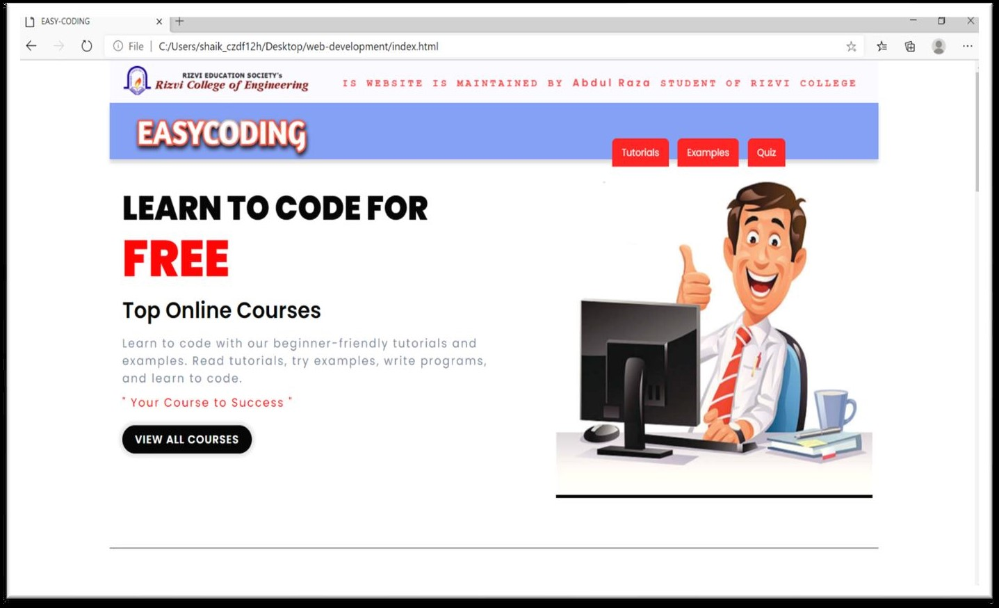
## Top Online Courses Page :
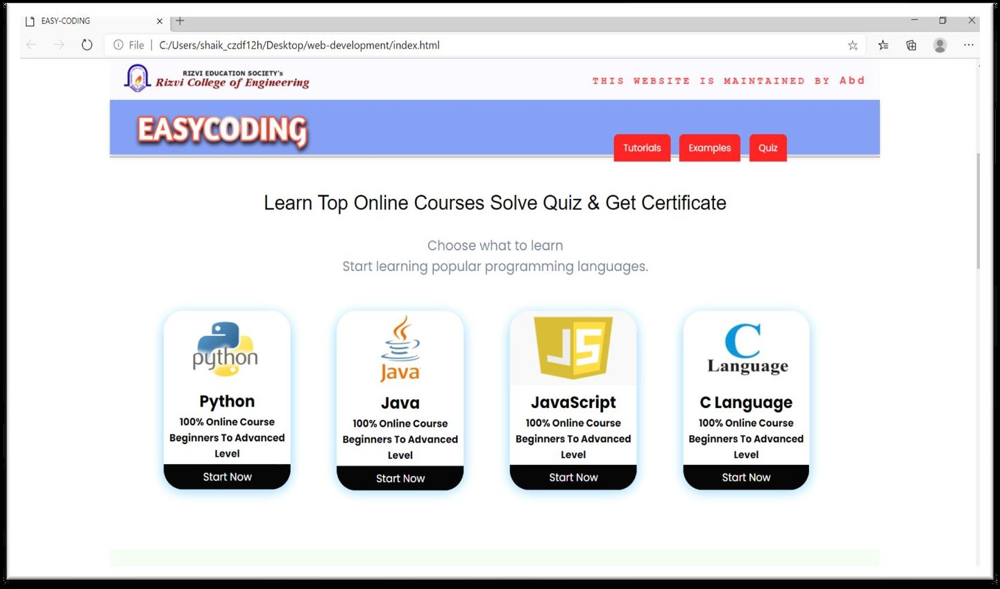
## Our Feature Page :
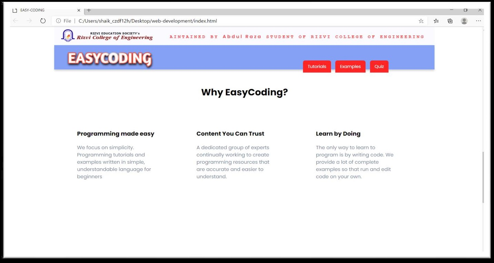
## Subscribe Page :
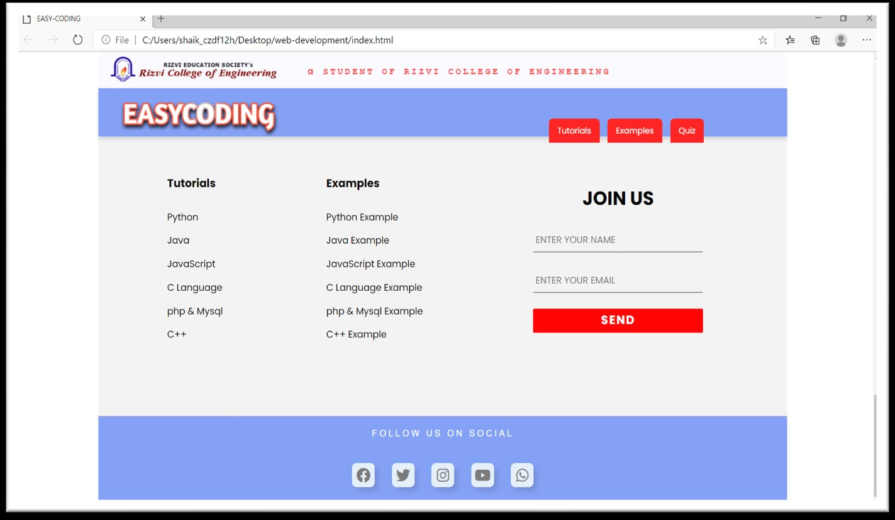
## Starting Page of Courses : 
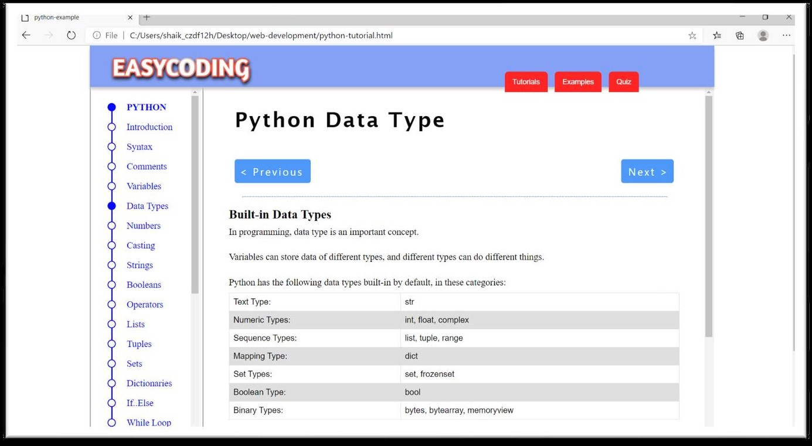
## Starting Page of Quiz Rules :
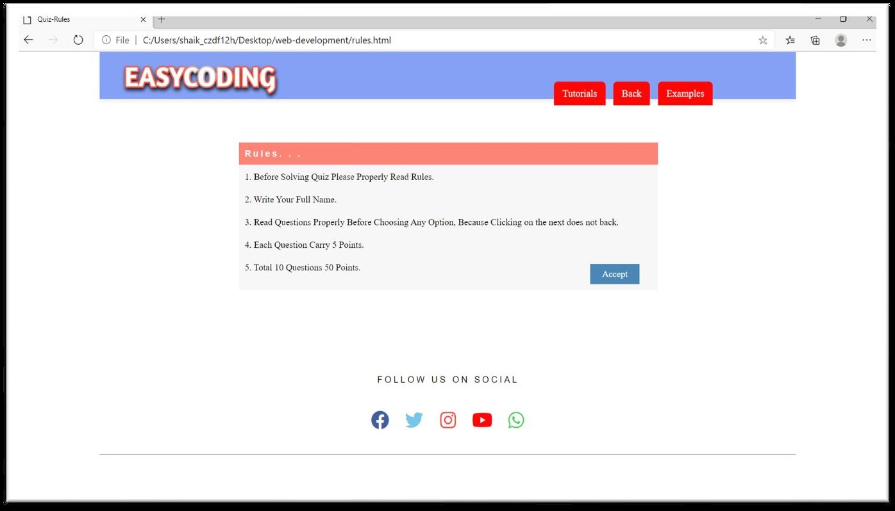
## Starting Page of Quiz :
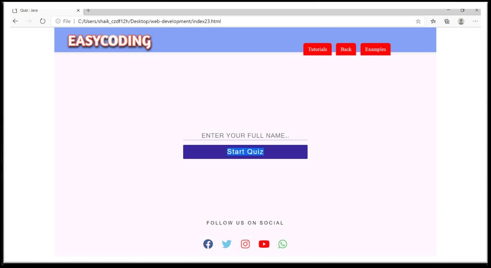
## Starting Page Of Question : 
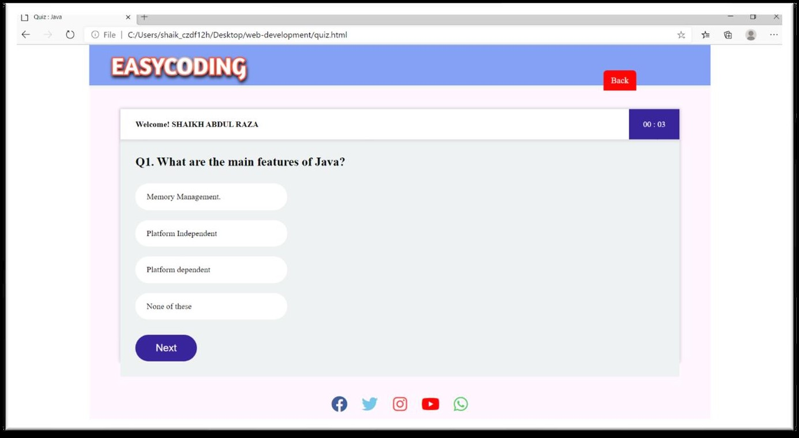
## Questions : 
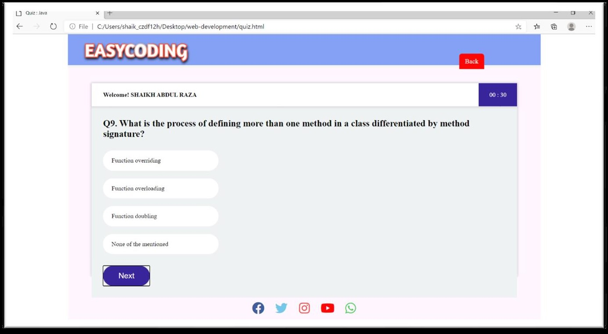
## Result Page :
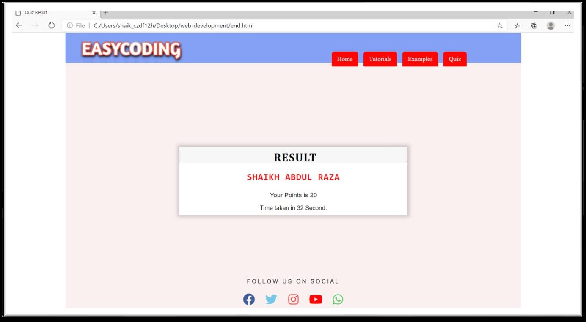
## Starting Page Of Practice Question :
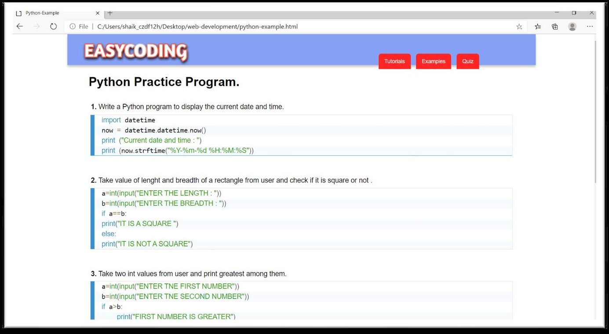
